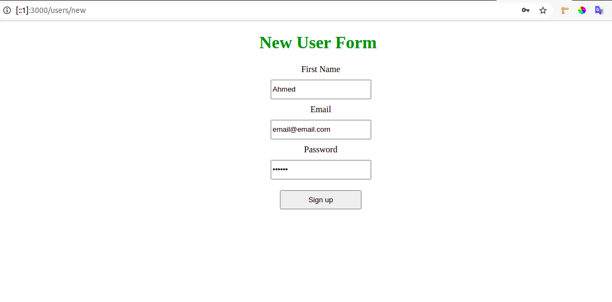
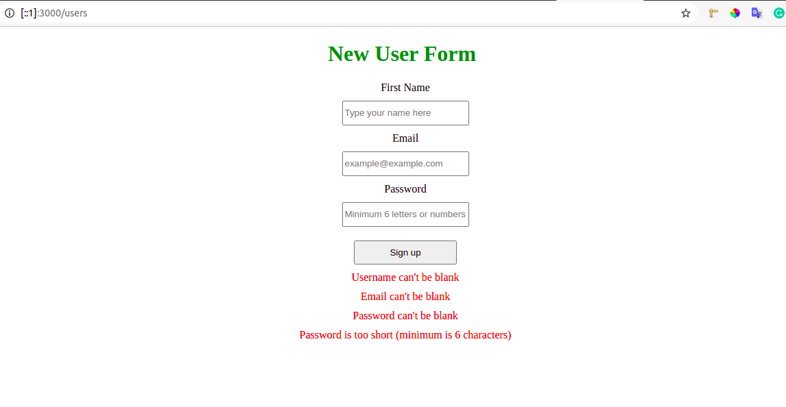
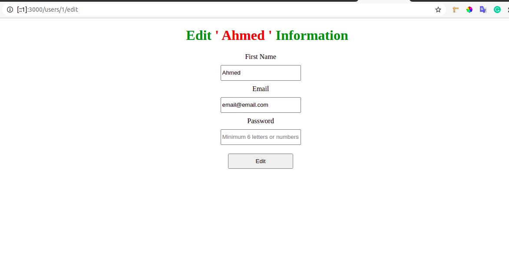
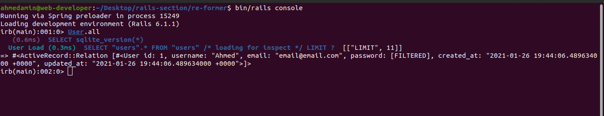

# Forms with rails

In this project, I used multiple ways to build a form in rails that can send parameters to a controller so that it can build an instance of a model with those parameters. 

### By this form you can create new users and edit their information:


## Create new user:


## Validation in the form:


## Edit the user information:


## Built With

- Ruby 2.7.0
- Ruby on Rails 2.7.0

### Setup

1. To run this project locally, please ensure you have Ruby and Ruby on Rails installed on your machine.
2. Open the terminal.
3. Clone this repository by running:

```bash
git clone https://github.com/AhmedAmin90/rails_form
```


4. Enter to the folder of the project in your local machine and After that write in the terminal:

```bash
bin/rails server
```
To run the server.

5. Open http://localhost:3000/users/new to create new users or http://localhost:3000/users/:id/edit
Where :id = the id number of the user.

6. If you want to check the id number of the user you can write in the terminal:

```bash
bin/rails console
```
Then write User.all to see list of all users in the database as this screenshot:



### Author

👤 **Ahmed Amin*

- Github: [@AhmedAmin90](https://github.com/AhmedAmin90)
- Twitter: [@AhmedAmin12383](https://twitter.com/AhmedAmin12383)
- LinkedIn: [AhmedAmin](https://www.linkedin.com/in/web-developer)

## Show your support

Give a ⭐️ if you like this project!

## Acknowledgments

- Microverse
- The Odin Project

## 📝 License

This project is [MIT](LICENSE) licensed.
